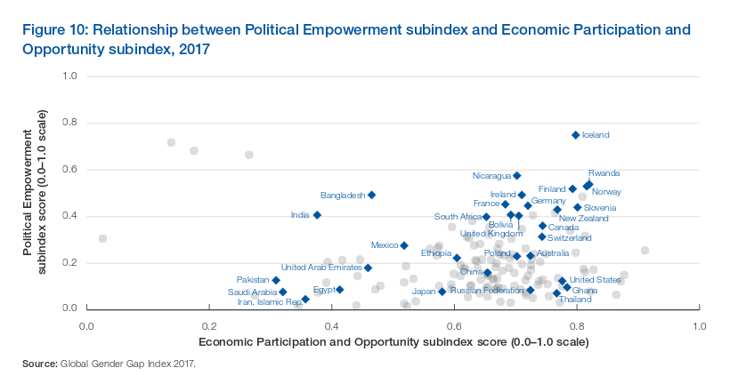

### Starting from a Viz for Social Good project ...

 [**Viz for social good**](https://www.vizforsocialgood.com/) is a platform for data visualization enthusiasts who aspire to **empower mission-driven organizations and increase awareness of social issues** through beautiful and informative visualizations. 

|  | This time, [**Pollicy**](https://www.vizforsocialgood.com/join-a-project/pollicy) organisation bring a topic through its initiative [**Vote: Women**](votewomen.pollicy.org), which aims to empower women to follow their ambitions of civic leadership and women’s representation.

Through this Viz for social good project, the goal of Vote: Women  is to **create dialogue on women's leadership in Uganda and the overall East Africa region**, and from there launch their capacity programs. They are interested in :

* Opportunities to support more women in leadership positions, and particularly, women leaders focused on women's issues. 

* Data showing the general overview of issues around promoting women in political positions their needs and challenges.

 
### ...raising the question of what bring more gender equality ?
From there, I wondered. Even if I do believe more women emporwement in politics is key, does it relate to more gender equality at the end ? Is it the only way to achieve more equality ?
And also, is there facts and discrimination that prevent women to access politics ?

 
### Let’s have an overview of this complex topic :
1. Women in politics today, view from history of women’s right to vote. Are quotas related to more Women in politics ?
2. Is the current women proportion in politics enough to reach gender equality on the ground ? Does it actually matter ?
3. Making stories with data, do not forget the people stories behind: real stories from East Africa
4. The case for gender equality, and how are we gonna get there ?

 

## 1 - Women in politics today, view from history of women’s right to vote
### All countries don't come from the same way, yet women in parliament spread all over the world

	

		<g> <b>This is the average percentage of women in parliament for each continent</b>  
		<i>Click play to see how it relates to women's vote right year</i> 
		</g>
	
 
	<svg id="vote"></svg>

Africa and Oceania, on average with women's right vote 30 years after Europe, have 10 to 24% of women in parliament. Asia with 20 years difference comes just above 15%.

Africa and Europe especially have countries that range on almost the whole spectrum of parliament representation for women.

_Sources :_
- _[Women in parliament as of 1st January 2018, compiled by the Inter-Parliamentary Union](http://archive.ipu.org/wmn-e/classif.htm)_
- _[The women suffrage timeline](http://womensuffrage.org/?page_id=69)_
 

### Did quotas bring more Women into Politics ?
Given the spreading of women in parliament percentage all over the world, yet with a different background of women suffrage, we can wonder wheter the use of quotas is directly related to women representation today.

*Let's explore this for each contient:*

	

	<svg id="quotas"></svg>

Overall, quotas use and no use spread all over the spectrum of women representation in parliament. In South America, a majority of countries set up quotas, with women representation range from 10 to 50%

Well the impact of quotas is not that simple. Each country situations might be specific, and a lot of research as been done on quotas efficiency depending on countries situation. ADD LINK HERE.

_Sources :_
- _[Women in parliament as of 1st January 2018, compiled by the Inter-Parliamentary Union](http://archive.ipu.org/wmn-e/classif.htm)_
- _[The women suffrage timeline](http://womensuffrage.org/?page_id=69)_
- _[OECD 2014 SIGI Index with quotas in political subindex](http://stats.oecd.org/Index.aspx)_

 

## 2 - Is the current women proportion in Politics enough to reach gender equality on the ground ? 
*And does it actually matter ?*

First, let's consider how the gender equality is measured out there. I found two main approches :
* Measure **outcome indicators** focusing on the facts related to gender equality : *litteracy rate, enrollment in education rate, wage equality for similar work ...*
Mainly this is the Gender Gap Index of the World Economic Forum [Read more](http://reports.weforum.org/global-gender-gap-report-2017/measuring-the-global-gender-gap/)

* Measure **income indicators** focusing on what might cause gender equality as laws and pollicies : *inheritance rights for daughters and sons, equal and secure access to land use, control and ownership ...*
Mainly this is the SIGI index of OECD [Read more](https://www.genderindex.org/data/)

The principal motive for **outcome indicators** is not to focus on spotting policies or specific actions *(which real impact might be difficult to assess precisly)* but facts to encourage closing the actual gap. 
[Read more about this](https://www.project-syndicate.org/commentary/learning-without-theory-by-ricardo-hausmann-2016-03?barrier=accessreg)

Yet knowing the actual situation of discrimination by laws against women is important, and we will have a look at **income indicators** as well.

### Outcome indocators by the World Economic Forum
As per the 2017 Gender Gap Report, the percentage closing the gap between women and men *(100% mean there is no gap)* is provided by subindex :
* **96%** of the gap in health outcomes
* **95%** of the gap in educational attainment
* only **58%** of the economic participation 
* and **23%** of the political gap

Moreover, the Gender Gap report analyse that **women political empowerment have a positve impact** and might be correlated to women economic participation.
> In the political sphere, women’s engagement in public life has a positive impact on inequality across society at large. 
> The issues that women advocate, prioritize and invest in have broad societal implications, touching on family life, education and health. 
> Women’s engagement in public life fosters greater credibility in institutions, and heightened democratic outcomes. 
> In addition, there is a range of evidence suggest that women’s political leadership and wider economic participation are correlated.

 

### Policy indicator and  measures of discrimination against women in social institutions 
Using the most recent SIGI Index (2014) and percentage of women in parliament in 2014, let's have a look at discrimination on four main topics for each country.

* **Discriminatory Family Code** : Early Marriage, Inheritance rights of daughters and widows, Parental authority in marriage an divorce
* **Restricted physical integrity** : Laws on domestic violence, rape, sexual harassment; Attitudes toward violence; Prevalence of violence in the lifetime; Female genital mutilation prevalence; Reproductive autonomy
* **Son bias** : Missing women, Fertility preferences
* **Restricted resources and assets** : Secure access to land and non-land assets, Access to financial services

[See the full descritpion of subindexes](https://www.genderindex.org/data/)

*NB : the Restricted civil liberties subindex was not represented here, because its political representation (% of women in parliament) component is already used as Y axis*

A value of 0 mean no discrimination, so **we will highlight all country above a medium level of discrimination** represented by 0.5 value, compared to the percentage in women in parliament on the vertical axis.

	<svg id="sub1"></svg>
	<svg id="sub2"></svg>

	<svg id="sub3"></svg>
	<svg id="sub4"></svg>

Conclusion

_Source :_
* _[OECD 2014 SIGI Index](http://stats.oecd.org/Index.aspx) (only countries with all data on subindex have been displayed)_
* _[Percentage of women in pariliament in 2014, United Nations Department of Economic and Social Affairs, via Data.world](https://data.world/hdx/6c04bd98-3a35-4d55-8842-1e91d3375594)_

## 3 - Making stories with data, do not forget the people stories behind, looking in East Africa

Let’s take a step back from overall data and the big picture. 
Focusing on the rise of women in parliament is East Africa, let’s take a closer look at more grounded stories.

### The 2016 election campaign for women in Uganda
*Qutoting the [report on gender and women's participation in 2016 elections in Uganda](https://drive.google.com/file/d/0B-5NtN1umK0ScWN6ZHVmVzJtYzg/view)*
*, we will see that discrimination and challenges are still strongly present. Uganda has 34.3% of women in parliament, as of early January 2018.*

While **the legal framework on the campaigns does not discriminate** against women and men during the elections, **women are facing challenges due to the social, economic**
**and cultural construction of Ugandan society**. 

These include: 
* less access to resources than their male counterparts; 
* gender roles which at times prevent them participating in politics; 
* religious and cultural obstacles to their participation; domestic violence among others.
* Sexual pacification of women is the silent cancer in our election. The reports are that this problem is at the peak during primaries.

On the media side:
 * Analysts reviewed which women issues were anchored by candidates in their campaign messages. 
Women health and education were discussed, yet 0 mention on Women’s land and property rights while it's a main issue for women in Uganda.
* Women are less source of information in newspapers on elections than their male counterparts

**ADD CONCLUSION**

### The daily life of girls and political women in Rwanda, the country with the highest percentage of women in parliament
*Immediately following the genocide, Rwanda's population of 5.5 million to 6 million was 60 to 70 percent female.*
*The call for equality was led by President Paul Kagame. The new constitution, passed in 2003, decreed that 30 percent of parliamentary seats be reserved for women.*

As of early January, Rwanda lead the women representation in parliament in the world with 61.3%	in the lower-housese and 38.5% in the upper-house.

**Justine Uvuza, doctor at Newcastle University, returned to Rwanda to interview female politicians about their lives**
*[Quoting from the NPR story](https://www.npr.org/sections/goatsandsoda/2016/07/29/487360094/invisibilia-no-one-thought-this-all-womans-debate-team-could-crush-it)*

Justine would end each interview asking these female legislators what seemed to her to be an obvious question: 
Would they support a Rwandan women's movement? A movement to change not just the public roles for women but to re-evaluate gender relations on all levels? Would these powerful Rwandan women be willing to stand under the banner of feminism?
Almost all of the women said no. Feminism? "That's not Rwandan," they told her. "That's for Westerners."
[Read Justine Uvuza's thesis](https://theses.ncl.ac.uk/dspace/bitstream/10443/2475/1/Uvuza,%20J.%2014.pdf)

**Leading a debate team in college, from quiet to power posing**
*[Quoting from the NPR story](https://www.npr.org/sections/goatsandsoda/2016/07/29/487360094/invisibilia-no-one-thought-this-all-womans-debate-team-could-crush-it)*

In high school, Mireille found that teachers and students took for granted that the head of a club should be a boy. 
When she would stand up in front of her class and ask, "Why can't the head be a girl?" they would tell her, "That's for Americans. You're trying to be an American."
And when she did finally become head of a club — the debating club in her all-women's college — she faced another struggle: 
Could she and her team members succeed in the male-dominated world of collegiate debate?

[Read the full story on npr.org](https://www.npr.org/sections/goatsandsoda/2016/07/29/487360094/invisibilia-no-one-thought-this-all-womans-debate-team-could-crush-it)

**These are no data, but still convey how many more challenges are still barriers in the way to equality.**
Uganda, Rwanda, along with others countries in East Africa and all over the world are rising in women political representation. 
A deep understanding of the country political and cultural context is yet key to assess the gender gap and identify actions to take.

## 4 - The case for gender equality

[Quoting the 2017 World Economic Forum Gender Gap Report](http://reports.weforum.org/global-gender-gap-report-2017/the-case-for-gender-parity/)
*It is pertinent to note that gender parity is also fundamental to whether and how economies and societies thrive. Ensuring the healthy development and appropriate use of half of the world’s total talent pool has a vast bearing on the growth, competitiveness and future-readiness of economies and businesses worldwide.*

The analysis also mention that :
* Compared to general public investment into labour market and education programmes, **targeted gender equality promotion has been found to create a particularly strong impact on GDP**;
* Across all countries, making **full use of women’s capabilities paves the way to optimizing a nation’s human capital potential** ;
* Women’s participation in the formal economy, or lack thereof, is also a business issue—costing women, companies and, ultimately, entire economies ;
* Additionally, the global economy is currently in transition to a Fourth Industrial Revolution. 
In such a highly interconnected and rapidly changing world, diversity is critical to informed corporate decision-making and business innovation.

**So maybe gender equality should be everybody's business ?**

 
### So how are we gonna get there ?

Description

**Invest political power**
* With more women in politics, with dedicated measure to overcome discrimination if needed as **Vote:Women** aim to provide.
* Raise awarness gender issue overall. Given the case for gender equality, not only women should work towards it ! Neither should they act only about this. Bring more people to the table, whatever the gender !

**Create gender framework as OECD : Link to awesome paprer, that highlight that**

FINIR ICI

* All institutions within a country must work together
* One major requirement to plan gender action and measure its impact is data collection !!

Read the rapport here : [Women, Government and Policy Making in OECD Countries](https://uweboard.files.wordpress.com/2014/08/women-government-and-policymaking.pdf)

**Civic action, and surely many others !!**

<link rel="stylesheet" href="sigisubindex.css">
